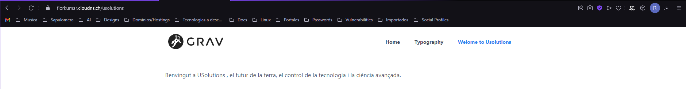

## Índex de Continguts

- [Introducció a Grav CMS](#introducció-a-grav-cms)
- [Característiques principals](#característiques-principals)
- [Instal·lació de Grav CMS](instal·lació.md)
- [Configuració de Grav CMS](cms-config.md)
- [Tipografia](#tipografia)


# Introducció a Grav CMS


Grav CMS és un sistema de gestió de continguts (CMS) modern i de codi obert que se centra en la simplicitat i la velocitat. A diferència d'altres CMS tradicionals, Grav no utilitza una base de dades per emmagatzemar contingut, sinó que empra fitxers Markdown, cosa que el fa extremadament lleuger i fàcil d'utilitzar.

## Característiques principals

- **Rendiment ràpid**: Gràcies a la seva arquitectura basada en fitxers, Grav és extremadament ràpid i eficient.
- **Flexibilitat**: Grav permet una gran personalització a través del seu sistema de plantilles i plugins.
- **Markdown**: Utilitza Markdown per a la creació de contingut, cosa que facilita l'edició i el manteniment.
- **Extensible**: Compta amb una àmplia gamma de plugins i temes que es poden instal·lar per ampliar les seves funcionalitats.
- **SEO amigable**: Inclou característiques integrades per millorar el SEO del teu lloc web.

> Grav CMS és ideal per a desenvolupadors i usuaris que busquen una solució de CMS lleugera i potent sense la complexitat dels sistemes tradicionals basats en bases de dades.

### Requisits mínims de hardware

Abans d'instal·lar Grav CMS, assegureu-vos que el vostre servidor compleixi els següents requisits mínims de hardware:

- **CPU**: Processador de 1 GHz o superior.
- **Memòria RAM**: Almenys 512 MB de RAM.
- **Espai d'emmagatzematge**: Almenys 100 MB d'espai lliure en disc per a la instal·lació bàsica de Grav CMS. Es recomana tenir més espai disponible per a contingut addicional i còpies de seguretat.
- **Connexió a Internet**: Necessària per descarregar Grav CMS i els seus plugins, així com per a l'accés remot i actualitzacions.

Un cop tingueu tots aquests requisits, podeu procedir amb la instal·lació de Grav CMS seguint les instruccions proporcionades a la secció [Instal·lació de Grav CMS](instal·lació.md).

### Requisits del sistema operatiu

A més dels requisits de hardware, assegureu-vos que el vostre servidor tingui un sistema operatiu compatible amb Grav CMS. Els sistemes operatius recomanats són:

- **Linux**: Qualsevol distribució moderna com Ubuntu, CentOS, Debian, etc.
- **Windows**: Windows 7 o superior.
- **macOS**: macOS 10.10 o superior.

És important tenir un servidor web com Apache, Nginx o IIS instal·lat i configurat correctament, així com PHP 7.1.3 o superior amb les extensions necessàries.

### Requisits de Programari

A més dels requisits de hardware i sistema operatiu, necessitareu el següent programari per executar Grav CMS:

- **PHP**: Versió 7.1.3 o superior amb les extensions següents:
    - `curl`
    - `dom`
    - `gd` 
    - `mbstring`
    - `xml`
    - `zip`
    - `php`
- **Unzip**: Opcional, però recomanat per a la descompressió de fitxers.

Assegureu-vos que el vostre entorn de desenvolupament o servidor de producció tingui aquests requisits de programari instal·lats i configurats correctament per garantir el funcionament òptim de Grav CMS.


# Creació de Pàgines

## Versió Grav

- Per crear pàgines a la pàgina per defcete de Grav tenia un guia de com fer-ho, igualment ho explicarem aqui pas a pas, primerament haurem d'obrir la consola de Ubuntu (SSH) i atravessar les carpetes `/grav-admin/user/pages` amb la comanda `cd /var/www/grav-admin/user/pages`.

- Per crear una nova pàgina és tan fàcil com crear un directori amb el número i nom de la pàgina que voleu donar. En el meu cas crearé un amb nom de _USOLUTIONS_.

    ```bash
    sudo mkdir 03.usolutions
    sudo nano 03.usolutions/default.md
    ```
    ```markdown
    ---
    title: Welcome to Usolutions
    ---

    Benvingut a USolutions, el futur de la terra, el control de la tecnologia i la ciència avançada.
    ```

    > Ctrl + S (Per guardar) i Ctrl + X (Per sortir)

- Una vegada creat el fitxer amb el default.md, recàrreguem el navegador i podem veure que a la nostra pàgina de grav tenim una altra pàgina que es la que hem creat fa poc a la consola.



## Versió Grav-Admin

- Obrim el panell d'administració de Grav accedir al navegador amb `https://<el-teu-domini>/admin`. Ens demnarà credencials per logejar que són les que vam crear la primera vegada després de instal·lar Grav-admin.

- Ens dirigim cap a la secció **Pages** i allà es on podem administrar les pàgines de GravCMS.


## Tipografia

- Com ja sabeu, quan estem creant pàgines normalment s'utilitzen llenguatges de marcat com HTML i CSS per definir l'estructura i l'estil del contingut. Grav CMS permet utilitzar aquests llenguatges juntament amb Markdown per oferir una experiència de creació de contingut més rica i flexible. Per aprendre les funcionalitats i com funciona ens dirigirem cap a `https://<el-teu-domini>/typography` i aqui us explica com reacciona cada element del markdown visualment.