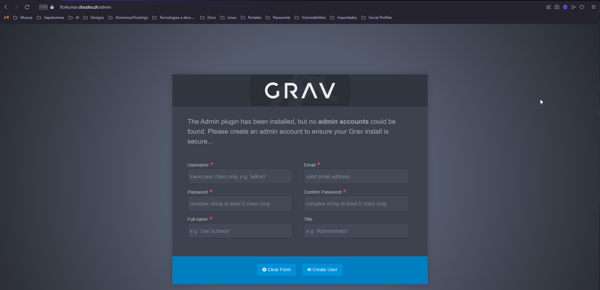

# Guia de coniguració e Grav CMS + Admin Plugin

## Configuració de Grav
- Després de fer tots els passos de instal·lació obrirem un navegador nou (el que vulgueu) i accedirem a httpss://<el-teu-domini>
- Si tot ha anat bé ens hauria de sortir una pàgina per crear un usuari del panell de Administració, igual que la següent imatge:

- Podeu posar qualsevol nom, es el que us demanarà per accedir al panell de configuració

- Una vegada finalitzat estareu disn del Dashboard, anomenat com el controlador de Grav, aqui podeu controlar tots els elements del CMS , pàgines, cache, plugins, serveis, usuaris i seguretat.

