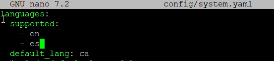
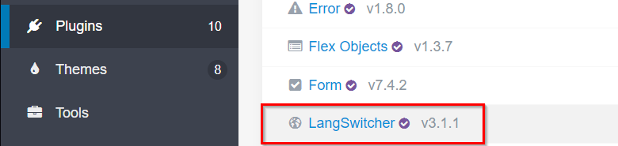
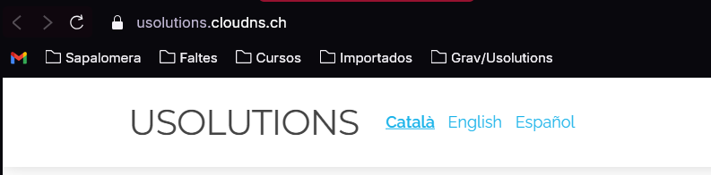
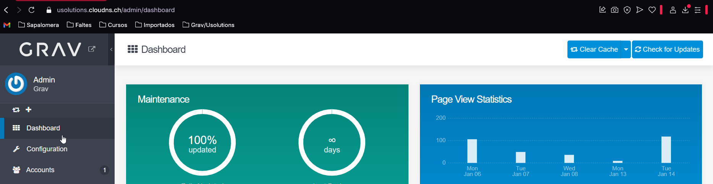
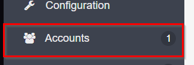
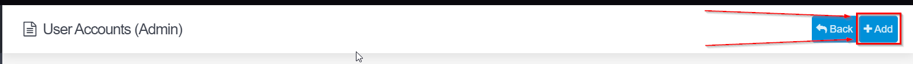
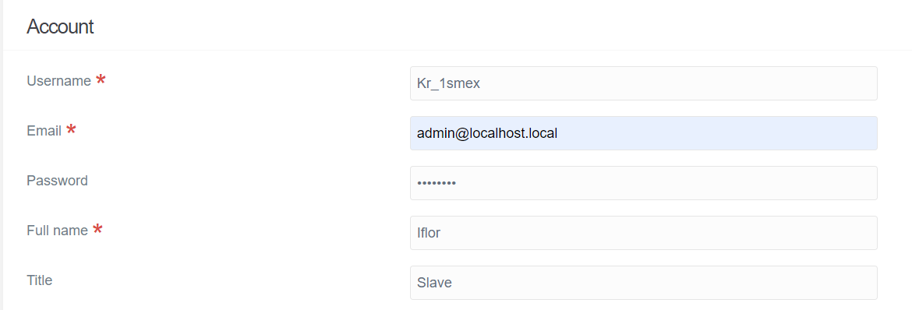
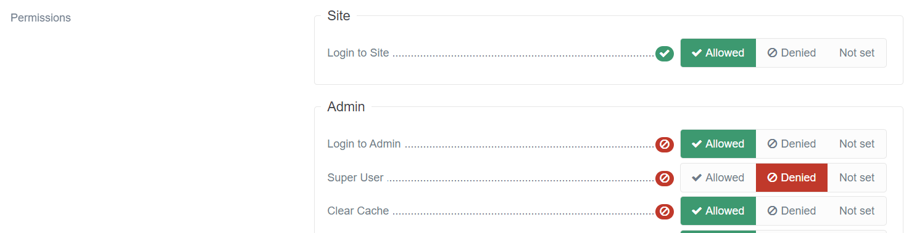
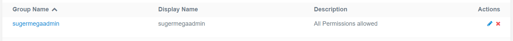

# Taula de Continguts de Configuració i Personalització de Grav CMS

1. [Configuració Bàsica](cms-config.md)
    - [Configuració del Fitxer `system.yaml`](#configuració-del-fitxer-systemyaml)
    - [Configuració del Fitxer `site.yaml`](#configuració-del-fitxer-siteyaml)
2. [Personalització del Tema](#personalització-del-tema)
    - [Selecció de Temes](#selecció-de-temes)
    - [Personalització de Plantilles](#personalització-de-plantilles)
    - [Ús de Twig per a Plantilles](#ús-de-twig-per-a-plantilles)
3. [Gestió de Plugins](#gestió-de-plugins)
    - [Instal·lació de Plugins](#instal·lació-de-plugins)
    - [Configuració de Plugins](#configuració-de-plugins)
4. [Creació de Contingut](#creació-de-contingut)
    - [Pàgines](#pàgines)
    - [Modulars](#modulars)
5. [Seguretat](#seguretat)
    - [Còpies de Seguretat](#còpies-de-seguretat)
    - [Gestió d'Usuaris](#gestió-dusuaris)
6. [Optimització del Rendiment](#optimització-del-rendiment)
7. [Tornar a l'inici](../README.md)

## Canvi d'Idioma per defecte

Per canviar l'idioma per defecte de Grav, segueix aquests passos:

1. Obre el fitxer `user/config/system.yaml` amb un editor de text.
2. Busca la secció `languages`.
3. Dins d'aquesta secció, trobaràs l'opció `default_lang`. Canvia el valor d'aquesta opció a l'idioma desitjat. Per exemple, per canviar l'idioma a català, hauries de tenir:

4. Desa els canvis i tanca el fitxer.

5. Per poder veure aquests canvis a la pàgina de forma visual instal·la el plugin anant a Plugins --> Add --> LangSwitcher (iactivar-ho)

6. Si ara anem a la pàgina principal veurem algo semblant a això:

## Creació d'usuaris i rols 

Per crear usuaris i rols en Grav Admin, segueix aquests passos:

1. Accedeix al panell d'administració de Grav.

2. Ves a la secció `Users` (Usuaris) des del menú lateral.

3. Fes clic a `Add` (Afegir) per crear un nou usuari.

4. Omple els camps necessaris com el nom d'usuari, contrasenya, correu electrònic, etc.

5. Assigna els rols adequats a l'usuari. Els rols determinen els permisos i l'accés dins del sistema. Alguns rols comuns són `admin`, `editor`, i `user`.

6. Desa els canvis fent clic a `Save` (Desar).

Per gestionar els rols(group):

7. Ves a la secció `Accounts`  i selecciona `Groups`. Aqui post definirels mateixos permisos a un rol i assignar als usuaris que vulguis d'una forma mésràpida i eficient.

Amb aquests passos, podràs gestionar els usuaris i els seus rols dins de Grav Admin de manera efectiva.

## Configuració de Domini
## Configuració de Domini

### Per què es fa?

Configurar un domini personalitzat per al teu lloc web Grav és important per diverses raons:

1. **Professionalitat**: Un domini personalitzat fa que el teu lloc web sembli més professional i de confiança.
2. **Branding**: Ajuda a reforçar la teva marca, ja que els visitants recordaran més fàcilment un domini personalitzat.
3. **SEO**: Els dominis personalitzats poden millorar el teu posicionament en els motors de cerca.
4. **Control**: Tens més control sobre el teu lloc web i les seves configuracions.

### Com es faria en ClouDNS

Per configurar un domini personalitzat en ClouDNS, segueix aquests passos:

1. **Registrar un Domini**: Si encara no tens un domini, registra'n un a través de ClouDNS o qualsevol altre registrador de dominis.

2. **Accedir al Panell de Control de ClouDNS**: Inicia sessió al teu compte de ClouDNS.

3. **Afegir un Nou Domini**:
    - Ves a la secció `Domains` i fes clic a `Add new domain`.
    - Introdueix el nom del teu domini i fes clic a `Add`.

4. **Esperar la Propagació DNS**: Els canvis DNS poden trigar fins a 24 hores a propagar-se completament.

Amb aquests passos, hauràs configurat correctament un domini personalitzat per al teu lloc web Grav utilitzant ClouDNS. 

