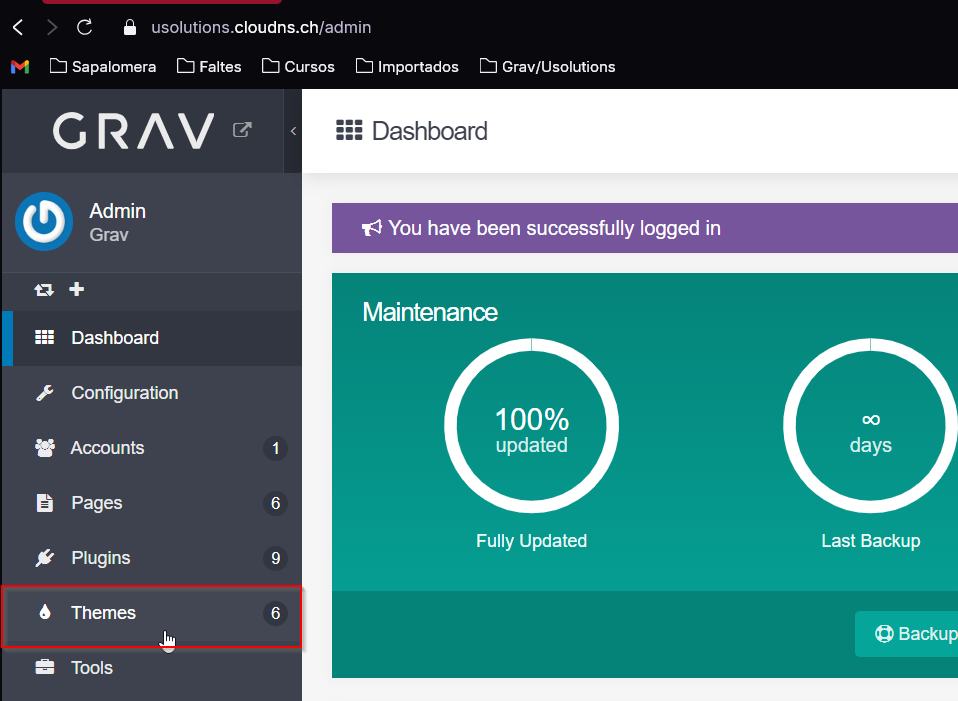

## Com instal·lar un tema en Grav Admin pas a pas

1. **Accedeix a Grav Admin**: Inicia sessió al teu panell d'administració de Grav.

2. **Navega a la secció de Temes**: Al menú lateral esquerre, fes clic a "Temes".

3. **Afegeix un nou tema**: Fes clic al botó "Afegeix" situat a la part superior dreta de la pàgina.

4. **Selecciona un tema**: Busca el tema que vols instal·lar de la llista de temes disponibles. Pots utilitzar la barra de cerca per trobar un tema específic.

5. **Instal·la el tema**: Fes clic al botó "Instal·la" al costat del tema seleccionat. Espera que la instal·lació es completi.

6. **Activa el tema**: Un cop instal·lat, fes clic al botó "Activa" per utilitzar el nou tema al teu lloc web.

7. **Configura el tema**: Després d'activar-lo, pots personalitzar el tema segons les teves necessitats des de la secció de configuració del tema.

Ara el teu lloc web de Grav utilitzarà el nou tema que has instal·lat i activat.