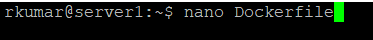
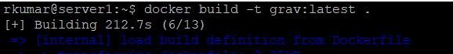
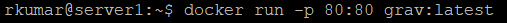

# Instal·lació de Grav Admin amb Docker via Dockerfile

Aquesta guia proporciona instruccions per instal·lar Grav Admin utilitzant Docker i un Dockerfile personalitzat.

## Requisits previs

- Docker instal·lat al vostre sistema. Podeu descarregar-lo des de [aquí](https://www.docker.com/get-started).

## Pas 1: Crear el Dockerfile

Creeu un fitxer anomenat `Dockerfile` al vostre directori de treball i afegiu-hi el següent contingut:



```Dockerfile
# Utilitzar una imatge base de PHP amb Apache
FROM php:7.4-apache

# Instal·lar les extensions necessàries de PHP
RUN docker-php-ext-install pdo pdo_mysql

# Instal·lar les eines necessàries
RUN apt-get update && apt-get install -y \
    unzip \
    git \
    && rm -rf /var/lib/apt/lists/*

# Descarregar i instal·lar Grav Admin
RUN curl -o grav-admin.zip -SL https://getgrav.org/download/core/grav-admin/latest \
    && unzip grav-admin.zip \
    && rm grav-admin.zip \
    && mv grav-admin/* /var/www/html \
    && chown -R www-data:www-data /var/www/html \
    && chmod -R 755 /var/www/html

# Exposar el port 80
EXPOSE 80

# Iniciar Apache
CMD ["apache2-foreground"]
```

## Pas 2: Construir la imatge Docker

Executeu la següent comanda al directori on es troba el vostre `Dockerfile` per construir la imatge Docker:

```sh
docker build -t grav-admin .
```


## Pas 3: Executar el contenidor Docker

Un cop la imatge estigui construïda, podeu executar un contenidor amb la següent comanda:

```sh
docker run -d -p 80:80 grav:latest
```


Això exposarà Grav Admin al port 8080 del vostre host. Podeu accedir-hi navegant a `http://localhost:8080` al vostre navegador.

## Conclusió

Ara teniu Grav Admin executant-se en un contenidor Docker. Podeu personalitzar el `Dockerfile` segons les vostres necessitats específiques.
