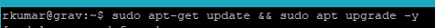
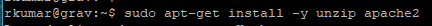
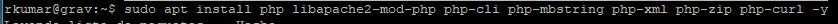
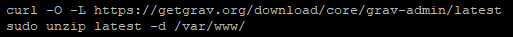
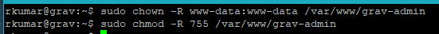
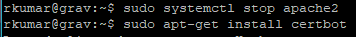
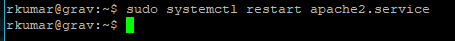

# Guia d'Instal·lació de Grav CMS

## Requisits de Maquinari

Abans d'instal·lar Grav CMS, assegureu-vos que el vostre servidor compleixi els següents requisits de maquinari:

-**Processador**: 1 GHz o superior

-**Memòria**: 512 MB de RAM o més

-**Emmagatzematge**: Almenys 100 MB d'espai lliure en disc

-**Servidor Web**: Apache, Nginx o IIS

## Passos d'Instal·lació

1.**Actualitzar el sistema operatiu**:

```bash
    sudo apt-get update && sudo apt-get upgrade -y
```



2.**Instal·lar servidor Web (i unzip per descomprimir)**:

```bash
    sudo apt-get install -y unzip apache2
```

3.**Instal·lar PHP**:

```bash
    sudo apt install php libapache2-mod-php php-cli php-mbstring php-xml php-zip php-curl php-gd -y
```


4.**Descàrregar i descomprimir Grav**:

- Per descàrregar els arxius de grav podem utilitzar curl, en cas de que no estigui instal·lat heu de executar la comanda:

```bash
    sudo apt-get install -y curl
```

- Per descàrregar heu de executar la comanda:

```bash
    curl -O -L https://getgrav.org/download/core/grav-admin/latest
```

- Per descomprimir a la carpeta on correspon heu de executar la comanda:

```bash
    sudo unzip latest -d /var/www/
```



5.**Configurar Permisos**:

```bash
    sudo chown -R www-data:www-data /var/www/grav-admin
    sudo chmod -R 755 /var/www/grav-admin
```



6.**Configuració de Certbot (Tecnologia de certificat gratuït, necesiteu tenir un allotjament web o una ip publica, pot ser la mateixa de casa)**:

- Procedirem a aturar apache2 i instal·lar amb la comanda:

```bash
    sudo systemctl stop apache2.service && sudo apt-get install -y certbot
```


- Necsiteu descobrir la vostra ip pública que amb aquest[link](https://www.cualesmiip.com) es pot esbrinar, copiau-ho per que ho utilitzarem.

- Utilitzarem Cloudns per crear un domini gratuït, ens hem de crear un compte i crear una zona nova --> Zona gratuïta. El nom de domini pot ser qualsevol que vulgueu i*Activau Dynamic DNS* i on demana la IP heu de posar la ip pública copiada d'abans. Una vegada fet s'actualitzarà automàticament i per comprovar només s'ha de fer un `nslookup` per veure que dona la ip pública que correspon.

- Ens faltarà crear un Nat Forwarding per redireccionar la solicitud de la Vm a la ip publica. Entrem al panell d'administració del router --> Opcions Avançades --> NAT --> Afegim 2 regles que seràn des de la nostra VM al port 80 i 443.


- Finalment sol·licitem el certificat des de certbot amb la comanda:

```bash
sudo certbot certonly -d `<el-teu-domini>`
```


7.**Configurar Servidor Web**

- Creem un arxiu de configuració de Grav per a que quan accedim amb el domini ens obri el Grav, creem l'arxiu amb la comanda:

```bash
    sudo nano /etc/apache2/sites-available/grav.conf
```

- Ha de contindre lo següent(on heu de substituir`<el-teu-domini>` pel vostre domini):

```apache

    <VirtualHost *:443>

    ServerName`<el-teu-domini>`

    ServerAlias www.`<el-teu-domini>`

    DocumentRoot /var/www/grav-admin

    <Directory /var/www/grav-admin>

    Options Indexes FollowSymLinks

    AllowOverride All

    Require all granted

    `</Directory>`

    ErrorLog ${APACHE_LOG_DIR}/grav-error.log

    CustomLog ${APACHE_LOG_DIR}/grav-access.log combined

    SSLEngine on

    SSLCertificateFile /etc/letsencrypt/live/`<el-teu-domini>`/fullchain.pem

    SSLCertificateKeyFile /etc/letsencrypt/live/`<el-teu-domini>`/privkey.pem

    `</VirtualHost>`

```


- Després també acldren desactivat els Llocs webs innecesàris(en aquest cas el que vé per defecte) i habilitar el mòdul ssl (xifrat):

```bash
    sudo a2dissite 000-default.conf && sudoa2enmodssl && sudoa2enmodrewrite
```

8.**Completar la Configuració**:

- Finalment caldrà reiniciar el servei apache2 amb:

```bash
    sudo systemctl restart apache2.service
```



Per a instruccions més detallades, consulteu la [documentació oficial de Grav](https://learn.getgrav.org/16/basics/installation).
